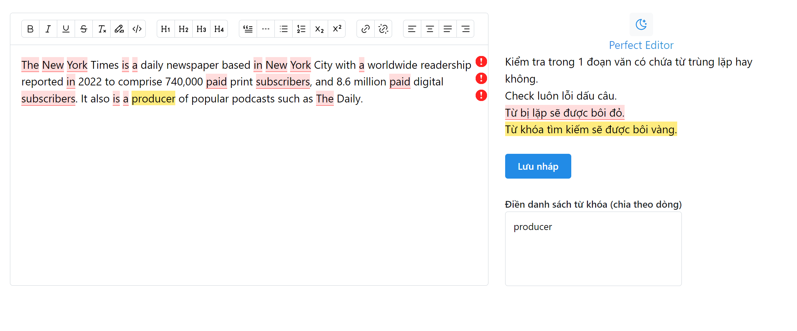

# Perfect Editor

- Supports find the duplicate in the paragraphs:
- Highlight duplicate words (occurs more than one time) with red backgrounds
- Find keywords in text with yellow background.

## Example:

## Libraries

- Tiptap editor (Prosemirror)
- Mantine UI
- NextJS

Deployed at: [perfector.vercel.app](https://perfector.vercel.app)
